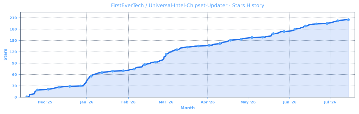
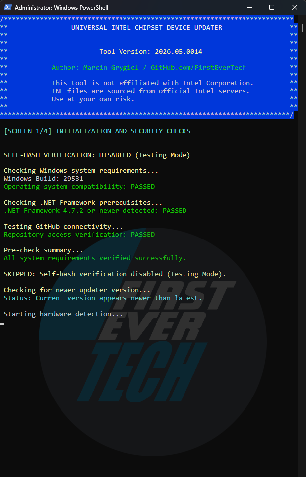
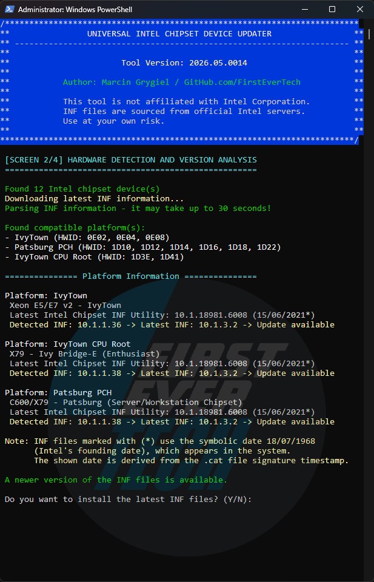
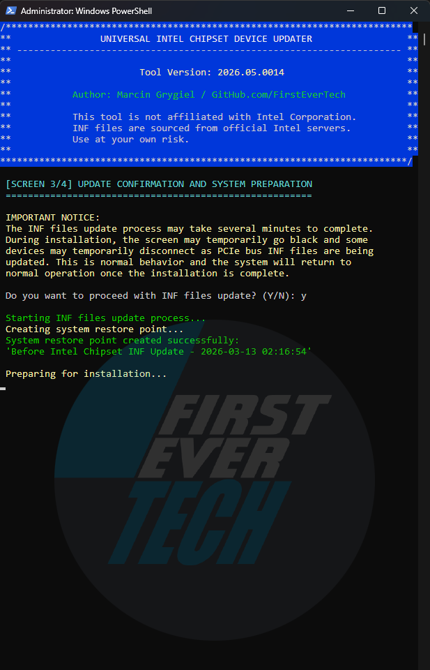
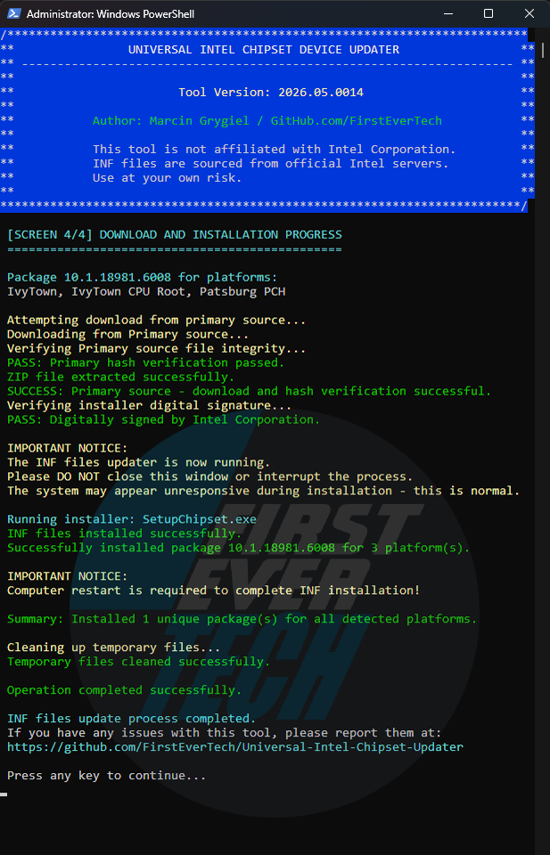

<p align="left">
  <a href="README.md">🇬🇧 English</a> |
  <a href="https://translate.google.com/translate?sl=en&tl=pl&u=https://github.com/FirstEverTech/Universal-Intel-Chipset-Updater">🇵🇱 Polski</a> |
  <a href="https://translate.google.com/translate?sl=en&tl=de&u=https://github.com/FirstEverTech/Universal-Intel-Chipset-Updater">🇩🇪 Deutsch</a> |
  <a href="https://translate.google.com/translate?sl=en&tl=fr&u=https://github.com/FirstEverTech/Universal-Intel-Chipset-Updater">🇫🇷 Français</a> |
  <a href="https://translate.google.com/translate?sl=en&tl=es&u=https://github.com/FirstEverTech/Universal-Intel-Chipset-Updater">🇪🇸 Español</a> |
  <a href="https://translate.google.com/translate?sl=en&tl=pt&u=https://github.com/FirstEverTech/Universal-Intel-Chipset-Updater">🇧🇷 Português</a> |
  <a href="https://translate.google.com/translate?sl=en&tl=nl&u=https://github.com/FirstEverTech/Universal-Intel-Chipset-Updater">🇳🇱 Nederlands</a>
  <br>
  <a href="https://translate.google.com/translate?sl=en&tl=zh-CN&u=https://github.com/FirstEverTech/Universal-Intel-Chipset-Updater">🇨🇳 中文</a> |
  <a href="https://translate.google.com/translate?sl=en&tl=ja&u=https://github.com/FirstEverTech/Universal-Intel-Chipset-Updater">🇯🇵 日本語</a> |
  <a href="https://translate.google.com/translate?sl=en&tl=ko&u=https://github.com/FirstEverTech/Universal-Intel-Chipset-Updater">🇰🇷 한국어</a> |
  <a href="https://translate.google.com/translate?sl=en&tl=it&u=https://github.com/FirstEverTech/Universal-Intel-Chipset-Updater">🇮🇹 Italiano</a> |
  <a href="https://translate.google.com/translate?sl=en&tl=tr&u=https://github.com/FirstEverTech/Universal-Intel-Chipset-Updater">🇹🇷 Türkçe</a> |
  <a href="https://translate.google.com/translate?sl=en&tl=ar&u=https://github.com/FirstEverTech/Universal-Intel-Chipset-Updater">🇸🇦 العربية</a> |
  <a href="https://translate.google.com/translate?sl=en&tl=hi&u=https://github.com/FirstEverTech/Universal-Intel-Chipset-Updater">🇮🇳 हिन्दी</a> |
  <a href="https://translate.google.com/translate?sl=en&tl=ru&u=https://github.com/FirstEverTech/Universal-Intel-Chipset-Updater">🇷🇺 Русский</a>
</p>

<a id="top"></a>
# 🚀 **Universal Intel Chipset Device Updater**

[](https://github.com/FirstEverTech/Universal-Intel-Chipset-Updater/releases)[](https://www.microsoft.com/windows)[](https://learn.microsoft.com/en-us/powershell/scripting/install/install-powershell-on-windows?view=powershell-7.5)[](https://dotnet.microsoft.com/en-us/download/dotnet-framework)[](https://github.com/FirstEverTech/Universal-Intel-Chipset-Updater/releases)[](https://github.com/FirstEverTech/Universal-Intel-Chipset-Updater)  
[](LICENSE)[](https://www.powershellgallery.com/packages/universal-intel-chipset-device-updater)[](https://github.com/FirstEverTech/Universal-Intel-Chipset-Updater/blob/main/AI_AUDITS.md)[](https://www.virustotal.com/gui/url/2890adddfe79484c51cc1464810bdf4ad5f5fea4d1a70fec00c278f897bf8333?nocache=1)[](https://github.com/FirstEverTech/Universal-Intel-Chipset-Updater/issues)

<a href="https://github.com/FirstEverTech">
  
</a>

## 🔧 Automate Your Intel Chipset Updates
**Universal Intel Chipset Device Updater** is an advanced, security-focused tool that automatically detects your Intel hardware and installs the latest official chipset **INF files** with enterprise-grade safety measures.

This project was built through a pragmatic collaboration between human expertise and AI-assisted tooling.  

### Why This Tool Exists
Intel's official Chipset Device Software has evolved over 25 years into a complex, bloated package. This tool simplifies the process by automatically detecting and installing only the INF files your system actually needs — nothing more, nothing less.

---

[](https://www.intel.com/content/www/us/en/search.html#q=inf)[](https://github.com/FirstEverTech/Universal-Intel-Chipset-Updater/blob/main/data/intel-chipset-infs-latest.md)[](https://github.com/FirstEverTech/Universal-Intel-Chipset-Updater/blob/main/data/intel-chipset-infs-latest.md)[](https://github.com/FirstEverTech/Universal-Intel-Chipset-Updater/blob/main/data/intel-chipset-infs-latest.md)

For detailed documentation and guides, see:  
→ **[The Whole Truth About Intel Chipset Device Software](https://github.com/FirstEverTech/Universal-Intel-Chipset-Updater/blob/main/docs/THE-WHOLE-TRUTH-ABOUT_EN_2026.md)**  
→ **[Behind the Project: Making Of](https://github.com/FirstEverTech/Universal-Intel-Chipset-Updater/blob/main/docs/BEHIND-THE-PROJECT_EN_2025.md)**  
→ **[INF Selection and SetupAPI Driver Ranking Model](https://github.com/FirstEverTech/Universal-Intel-Chipset-Updater/blob/main/docs/INF-SELECTION-SETUPAPI-RANKING-MODEL_EN_2026.md)**  
→ **[Deploying Universal Intel Chipset Device Updater via MDM](https://github.com/FirstEverTech/Universal-Intel-Chipset-Updater/blob/main/docs/MDM-DEPLOYMENT-GUIDE_EN_2026.md)**  
→ **[How to verify the latest INF files yourself](https://github.com/FirstEverTech/Universal-Intel-Chipset-Updater/blob/main/docs/HOW-TO-VERIFY-INF_EN_2026.md)**  

👉 [Share your feedback!](https://github.com/FirstEverTech/Universal-Intel-Chipset-Updater/discussions)

---

## 💖 Support This Project

**Universal Intel Chipset Device Updater** is free and open-source — maintained by a single developer.  
The hardware ID database requires constant updates, compatibility testing across hardware generations is ongoing, and new features are always in development.

[](https://www.patreon.com/c/firstevertech/membership)[](https://github.com/sponsors/FirstEverTech)[](https://www.paypal.com/donate/?hosted_button_id=48VGDSCNJAPTJ)[](https://buymeacoffee.com/firstevertech)[](https://ko-fi.com/firstever)

If this tool saved you time, improved device identification, or helped keep older hardware running — consider supporting development. 🎯 **[Follow on Patreon for free](https://www.patreon.com/FirstEverTech)** — stay updated on new releases and development progress.  

## 🏢 Sponsors
*No sponsors yet — [be the first and add your company ad!](https://www.patreon.com/c/firstevertech/membership)*

## ❤️ Supporters

A huge thank you to all our supporters – your contributions make a real difference.  
Your name could be here too. Every bit helps cover development costs and ensures these tools continue to improve.
<!-- SUPPORTERS_START -->
- Sqania, jadeanemail, westor7, J. A. Dean, Bartechr, tsantaliki
<!-- SUPPORTERS_END -->

## ⭐ Stars
If this project helped you, please click the "Star" button at the top of this page on GitHub.  



## 🌐 Community & Distribution

- Official threads on forums:  
🔗 **[TechPowerUp](https://www.techpowerup.com/forums/threads/tool-universal-intel-chipset-device-updater.346086/)**, **[Guru3D](https://forums.guru3d.com/threads/universal-intel-chipset-device-updater-open-source.460882)**, **[WinClub](https://winclub.pl/topic/49717-universal-intel-chipset-device-updater)**, **[ElevenForum](https://www.elevenforum.com/t/universal-intel-chipset-device-updater.41790)**, **[Win-Raid](https://winraid.level1techs.com/t/tool-universal-intel-chipset-device-updater)**, and **[Station-Drivers](https://www.station-drivers.com/index.php/en/forum/intel-chipsets-drivers/887-universal-intel-chipset-drivers-updater)**.

- For transparency and additional verification, the project is listed on:  
🔗 **[SourceForge](https://sourceforge.net/projects/universal-intel-chipset)**, **[Softpedia](https://www.softpedia.com/get/System/Universal-Intel-Chipset-Device-Updater.shtml)**, **[MajorGeeks](https://www.majorgeeks.com/files/details/universal_intel_chipset_device_updater.html)**, and **[Instalki](https://www.instalki.pl/download/programy/sterowniki/plyty-glowne/intel/universal-intel-chipset-device-updater/)**.

## 💼 Career Opportunity

> [!TIP]
> **I specialize in Windows deployment, driver automation, hardware compatibility, Microsoft technologies, infrastructure analysis, and custom IT tooling. If your organization faces automation, deployment, device management, or driver management challenges, let's discuss how I can help.**
>
> 🔗 **Business Contact:** [firstever.tech/contact](https://www.firstever.tech/contact)
> 🔗 **LinkedIn Profile:** [linkedin.com/in/marcin-grygiel](https://linkedin.com/in/marcin-grygiel)

---

<a id="table_of_contents"></a>
## 📑 **1. Table of Contents**

1. [**Table of Contents**](#table_of_contents)  
2. [**Release Highlights**](#release-highlights)  
   2.1 [Latest Version](#latest-version)  
   2.2 [Previous Release](#previous-releases)  
   2.3 [Older Releases](#older-releases)  
3. [**AI Audit_Reports**](#ai-audit-reports)  
4. [**Application Overview**](#application-overview)  
5. [**Key Features**](#key-features)  
   5.1 [Smart Hardware Detection](#smart-hardware-detection)  
   5.2 [Multi-Layer Security](#multi-layer-security)  
   5.3 [Seamless Operation](#seamless-operation)  
   5.4 [Comprehensive Coverage](#comprehensive-coverage)  
6. [**System Requirements**](#system-requirements)  
   6.1 [System Requirements Table](#system-requirements-table)  
   6.2 [Windows Version Support](#windows-version-support)  
   6.3 [Legacy System Notes](#legacy-system-notes)  
7. [**Quick Comparison**](#quick-comparison)  
8. [**Quick Start**](#quick-start)  
   8.1 [Method 1: One-Click Execution](#method-1-one-click-execution)  
   8.2 [Method 2: PowerShell Direct](#method-2-powershell-direct)  
   8.3 [Method 3: Hardware ID Scanner Only](#method-3-hardware-id-scanner-only)  
   8.4 [Method 4: PowerShell Gallery](#method-4-powershell-gallery)  
   8.5 [Command-Line Options](#command-line-options)  
9. [**How It Works**](#how-it-works)  
   9.1 [Self-Verification & Update Check](#self-verification-update-check)  
   9.2 [Hardware Detection](#hardware-detection)  
   9.3 [Database Query & Matching](#database-query-matching)  
   9.4 [Security Verification](#security-verification)  
   9.5 [Installation & Cleanup](#installation-cleanup)  
10. [**Security First Approach**](#security-first-approach)  
   10.1 [Verified Security Layers](#verified-security-layers)  
11. [**Usage Scenarios**](#usage-scenarios)  
   11.1 [Home Users](#home-users)  
   11.2 [IT Professionals & Technicians](#it-professionals-technicians)  
   11.3 [System Builders](#system-builders)  
12. [**Download Options**](#download-options)  
   12.1 [Option 1: SFX Executable (Recommended)](#option-1-sfx-executable-recommended)  
   12.2 [Option 2: Script Bundle](#option-2-script-bundle)  
   12.3 [Option 3: PowerShell Gallery](#option-3-powershell-gallery)  
   12.4 [Option 4: Source Code](#option-4-source-code)
14. [**Project Structure**](#project-structure)  
15. [**Release Structure**](#release-structure)  
   14.1 [Primary Files](#primary-files)  
   14.2 [Verification Files](#verification-files)  
   14.3 [Documentation](#documentation)  
16. [**Frequently Asked Questions (FAQ)**](#frequently-asked-questions-faq)  
   15.1 [Is this tool safe to use?](#is-this-tool-safe-to-use)  
   15.2 [Will this update all my Intel drivers?](#will-this-update-all-my-intel-drivers)  
   15.3 [What are the risks?](#what-are-the-risks)  
   15.4 [Where are files downloaded?](#where-are-files-downloaded)  
   15.5 [What if something goes wrong?](#what-if-something-goes-wrong)  
   15.6 [How does the automatic update check work?](#how-does-the-automatic-update-check-work)  
   15.7 [What does self-hash verification do?](#what-does-self-hash-verification-do)  
   15.8 [How are updates notified?](#how-are-updates-notified)  
   15.9 [Why is the certificate "not trusted"?](#why-is-the-certificate-not-trusted)  
   15.10 [Why does VirusTotal show detections for the SFX executable?](#why-does-virustotal-show-detections)  
17. [**Intel Platform Support**](#intel-platform-support)  
18. [**Performance Metrics**](#performance-metrics)  
   17.1 [Typical Execution Time Breakdown](#typical-execution-times)  
   17.2 [Disk Space Usage](#disk-space-usage)  
   17.3 [Memory (RAM) Usage](#memory-ram-usage)  
   17.4 [Resource Usage Summary](#resource-usage-summary)  
19. [**Known Issues**](#known-issues)  
20. [**Ready to Update?**](#ready-to-update)  
   19.1 [Quick Start Guide](#quick-start-guide)  
   19.2 [Verification Steps (Optional)](#verification-steps-optional)  
   19.3 [Need Help?](#need-help)  
21. [**Contributing**](#contributing)  
22. [**License**](#license)  
23. [**Acknowledgments**](#acknowledgments)  
24. [**Important Links**](#important-links)  
25. [**Author & Contact**](#author-and-contact)  

[↑ Back to top](#top)

---

<a id="release-highlights"></a>
## 🎉 **2. Release Highlights**

<a id="latest-version"></a>
### 2.1 Latest Version

**v2026.07.0015** → [Release Notes](https://github.com/FirstEverTech/Universal-Intel-Chipset-Updater/releases/tag/v2026.07.0015)

### 🆕 **Highlights**
- **EOL Device Support** — Enhanced database parser now correctly detects End-of-Life (EOL) platforms from the new `#### Platform EOL` section headers. EOL packages are installed first (oldest versions), followed by the latest packages, preventing newer INF files from being overwritten by older ones. Legacy HWIDs that were removed from the latest packages are now properly handled.

- **Multi-Signature Verification** — Updated digital signature validation to recognize all Intel certificate variants used over the years:
  - `Intel Corporation` (latest)
  - `Intel(R) Software and Firmware Products` (newer)
  - `Intel Corporation - Software and Firmware Products` (oldest)
  
  This ensures backward compatibility with older installer packages while maintaining strict security standards.

- **Configurable Credits Screen** — The credits screen is now fully dynamic and loaded from external `intel-chipset-infs-credits.txt` and `intel-chipset-infs-ads.txt` files. This allows easy customization of support links, career opportunities, and promotional content without modifying the core script. The screen supports interactive key shortcuts (1-5, A-E, L) that open configured URLs or exit the application.

- **Improved Database Parsing** — Fixed EOL detection logic to work with the new database format where EOL indicators are in section headers (`#### RaptorLake EOL`) rather than in the Package column. Platform names are now normalized (e.g., `RaptorLake` instead of `RaptorLake EOL`) for cleaner display.

### 🔧 **Technical Improvements**
- **EOL Detection**: Dual-mode parsing supports both old format (`(EOL)` in Package column) and new format (`#### Platform EOL` headers)
- **Signature Validation**: Enhanced with 3 Intel certificate patterns + expiration check + algorithm validation (SHA256/SHA1)
- **Credits Screen**: External configuration via `intel-chipset-infs-credits.txt` and `intel-chipset-infs-ads.txt`
- **Parser Robustness**: Fixed table separator detection (`---` now works alongside `:---`)
- **Backward Compatibility**: All changes maintain compatibility with existing database formats

### 📦 **Database Updates**
- Added EOL sections for 16 platforms (RaptorLake, AlderLake, CoffeeLake, TigerLakePCH-H, etc.)
- EOL packages contain legacy HWIDs that were removed from the latest Intel Chipset Device Software packages
- Installation order: EOL (oldest) → Main (latest) ensures all detected HWIDs receive the correct driver

---

[↑ Back to top](#top)

<a id="previous-releases"></a>
### 2.2 Previous Releases

**v2026.05.0014** → [Release Notes](https://github.com/FirstEverTech/Universal-Intel-Chipset-Updater/releases/tag/v2026.05.0014)

### 🆕 **Highlights**
- **Scanner 7.1 Database Improvements** — Better sorting of PCH families, fixed ArrowLake generation, added missing generic platforms, cleaned up legend (platforms without dedicated INF marked with `*`), and added explanatory notes (Wildcat Lake, 16th Gen, missing INF platforms)
- **Updater UI Overhaul** — Grouped HWID display (instead of one line per device), compact platform information (3 lines instead of 5), removed redundant `Generation:` label to prevent line wrapping, added parsing time hint, and simplified the header banner
- **Better Handling of Windows Inbox Drivers** — Inbox platforms are now clearly marked with a compact summary, not mixed with regular updates

---

[↑ Back to top](#top)

<a id="older-releases"></a>
### 2.3 Older Releases

- v2026.03.0013  → [Release Notes](https://github.com/FirstEverTech/Universal-Intel-Chipset-Updater/releases/tag/v2026.03.0013)
- v2026.03.0012  → [Release Notes](https://github.com/FirstEverTech/Universal-Intel-Chipset-Updater/releases/tag/v2026.03.0012)
- v2026.03.0011  → [Release Notes](https://github.com/FirstEverTech/Universal-Intel-Chipset-Updater/releases/tag/v2026.03.0011)
- v2026.03.0010  → [Release Notes](https://github.com/FirstEverTech/Universal-Intel-Chipset-Updater/releases/tag/v2026.03.0010)
- v2026.02.0009  → [Release Notes](https://github.com/FirstEverTech/Universal-Intel-Chipset-Updater/releases/tag/v2026.02.0009)
- v2026.02.0008  → [Release Notes](https://github.com/FirstEverTech/Universal-Intel-Chipset-Updater/releases/tag/v2026.02.0008)
- v2026.02.0007 (old v10.1-2026.02.2)  → [Release Notes](https://github.com/FirstEverTech/Universal-Intel-Chipset-Updater/releases/tag/v10.1-2026.02.2)
- v2026.02.0006 (old v10.1-2026.02.1)  → [Release Notes](https://github.com/FirstEverTech/Universal-Intel-Chipset-Updater/releases/tag/v10.1-2026.02.1)
- v2025.11.0005 (old v10.1-2025.11.8)  → [Release Notes](https://github.com/FirstEverTech/Universal-Intel-Chipset-Updater/releases/tag/v10.1-2025.11.8)
- v2025.11.0004 (old v10.1-2025.11.7)  → [Release Notes](https://github.com/FirstEverTech/Universal-Intel-Chipset-Updater/releases/tag/v10.1-2025.11.7)
- v2025.11.0003 (old v10.1-2025.11.6)  → [Release Notes](https://github.com/FirstEverTech/Universal-Intel-Chipset-Updater/releases/tag/v10.1-2025.11.6)
- v2025.11.0002 (old v10.1-2025.11.5)  → [Release Notes](https://github.com/FirstEverTech/Universal-Intel-Chipset-Updater/releases/tag/v10.1-2025.11.5)
- v2025.11.0001 (old v10.1-2025.11.0)  → [Release Notes](https://github.com/FirstEverTech/Universal-Intel-Chipset-Updater/releases/tag/v10.1-2025.11.0)


[↑ Back to top](#top)

<a id="ai-audit-reports"></a>
## 🔍 **3. AI Audit Reports**

This project has been reviewed by multiple AI systems across three independent cycles using structured security frameworks (OWASP, CWE, CVSS v3.1). These are code and architecture reviews, not formal penetration tests. Average score: 9.6/10 — with Claude (most critical reviewer) scoring 9.1/10 after four cycles starting from 8.3/10.

## Score History at a Glance

| Auditor | 2025-11-21 | 2026-02-01 | 2026-03-11 | Trend | Notes |
|---------|------------|------------|------------|-------|-------|
| ChatGPT | 9.4 | 9.6 | **9.7** | ↑ | Added self‑hash verification, restore points, and dual sources. Later refined with inbox driver handling and better detection, pushing score to 9.7. |
| Claude | 8.3 | 8.7 | **9.1** | ↑ | Initially docked for missing self‑hash and hardcoded paths. By March 2026, those were fixed, path handling switched to environment variables, and PSGallery publication completed. Reliability record (34K downloads, 1 confirmed bug) further justified the increase. |
| Copilot | 8.6 | 9.4 | **9.5** | ↑ | The largest jump (+0.8) came from adding multi‑layer verification, parallel scanner, and SFX signing. The March update consolidated with `-quiet` mode, MDM documentation, and 27K+ downloads with zero open issues. |
| DeepSeek | 8.7 | 9.2 | **9.4** | ↑ | Steady improvements in security, UX (dynamic support message, post‑install pause), and the fix for the INF scanner bug. Code quality refinements (bool flags, `Clear-Host`) pushed the score to 9.4. |
| Gemini | 9.0 | 9.5 | **10.0** | ↑ | Already high, Gemini awarded a perfect 10 in March, citing the tool’s “gold standard” maturity, 27K downloads, 13 resolved issues (most user‑environment), and the maintainer’s same‑day bug fixes. |
| Grok | 9.7 | 9.8 | **9.9** | ↑ | Grok’s baseline was already near‑perfect. The March update (improved inbox detection, expanded HWID coverage, dedicated uninstaller for error 1603) and zero open issues brought it to 9.9. |
| **Average** | **8.95** | **9.37** | **9.6** | ↑ | The average rose by 0.65 overall, driven by consistent security enhancements, code hygiene, and an exceptional real‑world reliability record (34K downloads, 1 confirmed bug). |

*For full score history across all audit cycles, methodology, and detailed audits, see [AI_AUDITS.md](AI_AUDITS.md).*

> **Note:** Latest audits conducted March 2026 (v2026.03.0011/0012). Core security architecture unchanged since audit.


[↑ Back to top](#top)

<a id="application-overview"></a>
## 🖼️ **4. Application Overview**

| Phase 1 | Phase 2 | Phase 3 | Phase 4 |
|:---------------:|:--------------:|:-------------------:|:-------------------:|
|  |  |  |  |
| *Security check and update check* | *Hardware detection and version analysis* | *Creating a system restore point* | *Download, verify and install* |


[↑ Back to top](#top)

<a id="key-features"></a>
## ✨ **5. Key Features**
<a id="smart-hardware-detection"></a>
### 🔍 5.1 Smart Hardware Detection
- Automatically scans for Intel chipset components
- Identifies specific Hardware IDs (HWIDs)
- Supports chipsets from Sandy Bridge to latest generations
- Detects both Consumer and Server platforms
<a id="multi-layer-security"></a>
### 🛡 5.2 Multi-Layer Security
- **SHA-256 Hash Verification** for all downloads
- **Digital Signature Validation** (Intel Corporation certificates)
- **Automated System Restore Points** before installation
- **Dual-Source Download** with backup fallback
- **Administrator Privilege Enforcement**
<a id="seamless-operation"></a>
### ⚡ 5.3 Seamless Operation
- No installation required - fully portable
- Automatic version checking and updates
- Clean, intuitive user interface
- Detailed logging and debug mode
- Save to Downloads folder option
<a id="comprehensive-coverage"></a>
### 🔄 5.4 Comprehensive Coverage
- Mainstream Desktop/Mobile platforms
- Workstation/Enthusiast systems
- Xeon/Server platforms
- Atom/Low-Power devices


[↑ Back to top](#top)

<a id="system-requirements"></a>
## 📋 **6. System Requirements**

<a id="system-requirements-table"></a>
### 6.1 System Requirements Table
| Component | Minimum | Recommended | Notes |
|-----------|---------|-------------|-------|
| Windows Version | 10 1809 (17763) | 11 22H2+ | 1809 requires .NET 4.7.2+ |
| .NET Framework | 4.7.2 | 4.8+ | Required for TLS 1.2 support |
| PowerShell | 5.1 | 5.1+ | Windows PowerShell 5.1 included |
| Administrator | Required | Required | For driver installation |
| Internet | Required | Required | For hash verification and updates |
| RAM | 2 GB | 4 GB+ | For INF extraction/installation |
| Disk Space | 500 MB | 1 GB+ | Temporary files during installation |
| System Restore | Optional | Enabled | Automatic restore point creation |

<a id="windows-version-support"></a>
### 6.2 Windows Version Support
| Version | Build | Status | Notes |
|---------|-------|--------|-------|
| Windows 11 | All builds | ✅ Full | Optimized support |
| Windows 10 | 22H2+ | ✅ Full | Recommended |
| Windows 10 | 21H2 | ✅ Full | Stable |
| Windows 10 | 21H1 (19043) | ✅ Full | Legacy |
| Windows 10 | 20H2 (19042) | ✅ Full | Legacy |
| Windows 10 | 2004 (19041) | ✅ Full | Legacy |
| Windows 10 | 1909 (18363) | ✅ Full | Legacy |
| Windows 10 | 1903 (18362) | ✅ Full | Legacy |
| Windows 10 | 1809 (17763) | ✅ Limited | Requires .NET 4.7.2+ for TLS 1.2 support |
| Windows 10 | LTSB 2016 (1607) | ⚠️ Limited | Manual updates required for TLS 1.2 |
| Windows 10 | LTSB 2015 (1507) | ⚠️ Limited | Manual updates required for TLS 1.2 |

<a id="legacy-system-notes"></a>
### 6.3 Legacy System Notes
- **Windows 10 1809 (17763) and newer**: Full TLS 1.2 support out-of-the-box
- **Windows 10 LTSB 2015/2016**: May require manual installation of:
  - [.NET Framework 4.8](https://go.microsoft.com/fwlink/?linkid=2088631)
  - [KB4474419](https://catalog.update.microsoft.com/Search.aspx?q=KB4474419) (SHA-2 update)
- **The tool automatically**: 
  - Detects Windows version limitations
  - Warns about potential connectivity issues
  - Provides fallback options for offline operation
- **Basic INF detection and installation** works even without internet connectivity


[↑ Back to top](#top)

<a id="quick-comparison"></a>
## ⚡ **7. Quick Comparison**

| Feature | This Tool | Intel DSA | Manual Installation |
|---------|-----------|-----------|---------------------|
| **Automatic Detection** | ✅ Full | ✅ Partial | ❌ Manual |
| **Security Verification** | ✅ Multi-layer | ✅ Basic | ❌ None |
| **System Restore Points** | ✅ Automatic | ❌ None | ❌ Manual |
| **Update Notifications** | ✅ Built-in | ✅ Yes | ❌ None |
| **Self-updating** | ✅ Yes | ❌ No | ❌ No |
| **Portable** | ✅ No install | ❌ Requires install | ✅/❌ Varies |
| **Free** | ✅ 100% | ✅ Yes | ✅ Yes |


[↑ Back to top](#top)

<a id="quick-start"></a>
## 🚦 **8. Quick Start**
<a id="method-1-one-click-execution"></a>
### 8.1 Method 1: One-Click Execution
```batch
# Download and run executable file as Administrator:
ChipsetUpdater-2026.03.0012-Win10-Win11.exe (or later version)
```
<a id="method-2-powershell-direct"></a>
### 8.2 Method 2: PowerShell Direct
```powershell
# Run PowerShell as Administrator, then:
.\universal-intel-chipset-device-updater.ps1
```
<a id="method-3-hardware-id-scanner-only"></a>
### 8.3 Method 3: Hardware ID Scanner Only
```batch
# For diagnostic purposes:
.\Intel-Platform-Scanner.ps1
```

<a id="method-4-powershell-gallery"></a>
### 8.4 Method 4: PowerShell Gallery

Install from PowerShell Gallery (Run PowerShell as Administrator):
```powershell
Install-Script universal-intel-chipset-device-updater
```

Manual update from PowerShell Gallery for v2026.03.0012 or older (Run PowerShell as Administrator):
```powershell
Update-Script -Name universal-intel-chipset-device-updater
```

Run from PowerShell Gallery (Run PowerShell as Administrator):
```powershell
universal-intel-chipset-device-updater
```

<a id="command-line-options"></a>
### 8.5 Command-Line Options

| Option | Description |
|--------|-------------|
| `-help`, `-?` | Display help and exit. |
| `-version`, `-v` | Display the tool version and exit. |
| `-auto`, `-a` | Automatically answer all prompts with Yes — no user interaction required. |
| `-quiet`, `-q` | Run in completely silent mode (no console window). Implies `-auto` and hides the PowerShell window. |
| `-beta` | Use beta database for new hardware testing (available from version 2026.03.0013). |
| `-debug`, `-d` | Enable debug output. |
| `-skipverify`, `-s` | Skip the script self-hash verification. **Use only for testing!** |

**Notes:**
- These options work when the script is executed directly via PowerShell or via the SFX package.
- For fully unattended deployments (e.g., Intune, SCCM), combine `-quiet` with administrator privileges.

**Examples:**
```powershell
.\universal-intel-chipset-device-updater.ps1 -auto
.\universal-intel-chipset-device-updater.ps1 -quiet
.\universal-intel-chipset-device-updater.ps1 -debug -skipverify
```

[↑ Back to top](#top)

<a id="how-it-works"></a>
## 🔧 **9. How It Works**
<a id="self-verification-update-check"></a>
### 🔒 9.1 Self-Verification & Update Check
- **Integrity Verification** - Validates script hash against GitHub release
- **Update Detection** - Compares current version with latest available
- **Security First** - Ensures tool hasn't been modified or corrupted
<a id="hardware-detection"></a>
### 🔍 9.2 Hardware Detection
- Scans PCI devices for Intel Vendor ID (8086)
- Identifies chipset-related components
- Extracts Hardware IDs and current driver versions
<a id="database-query-matching"></a>
### 📊 9.3 Database Query & Matching
- Downloads latest INF database from GitHub
- Matches detected HWIDs with compatible packages
- Compares current vs latest versions
<a id="security-verification"></a>
### 🛡 9.4 Security Verification
- Creates system restore point automatically
- Downloads from primary/backup sources
- Verifies SHA-256 hashes
- Validates Intel digital signatures
<a id="installation-cleanup"></a>
### ⚡ 9.5 Installation & Cleanup
- Executes official Intel setup with safe parameters
- Provides real-time progress feedback
- Automatic cleanup of temporary files


[↑ Back to top](#top)

<a id="security-first-approach"></a>
## 🛡 **10. Security First Approach**
<a id="verified-security-layers"></a>
### 🔒 10.1 Verified Security Layers
```text
1. Self-Integrity → Script Hash Verification
2. File Integrity → SHA-256 Hash Verification  
3. Authenticity → Intel Digital Signatures
4. Project Origin → SFX signed with self-signed certificate (commercial Code Signing cert planned — community funding welcome)
5. System Safety → Automated Restore Points
6. Source Reliability → Dual Download Sources
7. Privilege Control → Admin Rights Enforcement
8. Update Safety → Version Verification
```


[↑ Back to top](#top)

<a id="usage-scenarios"></a>
## 🎯 **11. Usage Scenarios**
<a id="home-users"></a>
### 🏠 11.1 Home Users
- **Keep system updated** without technical knowledge
- **Automatic safety checks** prevent installation issues
- **One-click operation** with clear prompts
<a id="it-professionals-technicians"></a>
### 💼 11.2 IT Professionals & Technicians
- **Batch deployment** across multiple systems
- **Comprehensive logging** for troubleshooting
- **Security verification** for corporate environments
<a id="system-builders"></a>
### 🛠 11.3 System Builders
- **Pre-installation preparation** for new builds
- **Driver consistency** across multiple systems
- **Time-saving automation** vs manual updates


[↑ Back to top](#top)

<a id="download-options"></a>
## 📥 **12. Download Options**
<a id="option-1-sfx-executable-recommended"></a>
### 12.1 Option 1: SFX Executable (Recommended)
- **File**: [`ChipsetUpdater-202x.xx.xxxx-Win10-Win11.exe`](https://github.com/FirstEverTech/Universal-Intel-Chipset-Updater/releases)
- **Features**: One-click execution, automatic extraction
- **Security**: Self-verifying SHA-256 hash check on every run, Authenticode signature verification of downloaded Intel installer packages
- **For**: Most users, easiest method
<a id="option-2-script-bundle"></a>
### 12.2 Option 2: Script Bundle
- **File**: [`universal-intel-chipset-device-updater.ps1`](https://github.com/FirstEverTech/Universal-Intel-Chipset-Updater/blob/main/src/universal-intel-chipset-device-updater.ps1)
- **File**: [`universal-intel-chipset-device-updater.bat`](https://github.com/FirstEverTech/Universal-Intel-Chipset-Updater/blob/main/src/universal-intel-chipset-device-updater.bat)
- **Features**: Full control, modifiable code, transparency
- **Security**: Self-verifying SHA-256 hash check on every run, Authenticode signature verification of downloaded Intel installer packages
- **For**: Advanced users, administrators, customization
<a id="option-3-powershell-gallery"></a>
### 12.3 Option 3: PowerShell Gallery
- **Method**: [`Install-Script universal-intel-chipset-device-updater`](https://www.powershellgallery.com/packages/universal-intel-chipset-device-updater) - PowerShell command
- **Features**: Versioned distribution via PSGallery, one-line install/update (`Update-Script`), no manual download or extraction, runs directly as an installed command
- **Security**: Self-verifying SHA-256 hash check on every run, Authenticode signature verification of downloaded Intel installer packages
- **For**: Advanced users, administrators
<a id="option-4-source-code"></a>
### 12.4 Option 4: Source Code
- **Method**: `git clone` the repository
- **Features**: Latest development version, full customization
- **For**: Developers, contributors

[↑ Back to top](#top)

<a id="project-structure"></a>
## 📁 **13. Project Structure**

**Key Files and Directories:**

`src/` - Main scripts directory
- [get-intel-hwids.bat](src/get-intel-hwids.bat) - Intel Chipset HWIDs Detection Tool Batch launcher
- [get-intel-hwids.ps1](src/get-intel-hwids.ps1) - Intel Chipset HWIDs Detection Tool PowerShell script
- [uninstall-intel-chipset.bat](src/uninstall-intel-chipset.bat) - Intel Chipset Device Software Uninstaller Batch launcher
- [uninstall-intel-chipset.ps1](src/uninstall-intel-chipset.ps1) - Intel Chipset Device Software Uninstaller PowerShell script
- [universal-intel-chipset-device-updater.ps1](src/universal-intel-chipset-device-updater.ps1) - Main PowerShell script
- [universal-intel-chipset-device-updater.bat](src/universal-intel-chipset-device-updater.bat) - Main Batch file
- [universal-intel-chipset-device-updater.ver](src/universal-intel-chipset-device-updater.ver) - Main Version file
- [universal-intel-chipset-updater.ver](src/universal-intel-chipset-updater.ver) - Old Version file *(deprecated since v2026.03.0011 — kept for reference only)*

`data/` - Data files
- [intel-chipset-infs-beta.md](data/intel-chipset-infs-beta.md) - Beta INF database
- [intel-chipset-infs-dev.md](data/intel-chipset-infs-dev.md) - Development INF database
- [intel-chipset-infs-latest.md](data/intel-chipset-infs-latest.md) - Latest stable INF database
- [intel-chipset-infs-download.txt](data/intel-chipset-infs-download.txt) - Download links
- [intel-chipset-infs-message.txt](data/intel-chipset-infs-message.txt) - Dynamic support message displayed at the end of the script (loaded from GitHub at runtime)

`docs/` - Documentation
- [BEHIND-THE-PROJECT_EN.md](docs/BEHIND-THE-PROJECT_EN_2025.md) - Project background (English)
- [BEHIND-THE-PROJECT_PL.md](docs/BEHIND-THE-PROJECT_PL_2025.md) - Project background (Polish)
- [HOW-TO-VERIFY-INF_EN_2026.md](docs/HOW-TO-VERIFY-INF_EN_2026.md) - Manual INF version verification guide (English)
- [HOW-TO-VERIFY-INF_PL_2026.md](docs/HOW-TO-VERIFY-INF_PL_2026.md) - Manual INF version verification guide (Polish)
- [INF-SELECTION-SETUPAPI-RANKING-MODEL_EN_2026.md](docs/INF-SELECTION-SETUPAPI-RANKING-MODEL_EN_2026.md) - INF Sel. and  SetupAPI Driver Ranking Model (English)
- [INF-SELECTION-SETUPAPI-RANKING-MODEL_PL_2026.md](docs/INF-SELECTION-SETUPAPI-RANKING-MODEL_PL_2026.md) - INF Sel. and  SetupAPI Driver Ranking Model (Polish)
- [MDM-DEPLOYMENT-GUIDE_EN_2026.md](docs/MDM-DEPLOYMENT-GUIDE_EN_2026.md) - Deploying the Tool via MDM (English)
- [MDM-DEPLOYMENT-GUIDE_PL_2026.md](docs/MDM-DEPLOYMENT-GUIDE_PL_2026.md) - Deploying the Tool via MDM (Polish)
- [NEW-RELEASE-GUIDE_EN_2026.md](docs/NEW-RELEASE-GUIDE_EN_2026.md) - New Release Guide (English)
- [NEW-RELEASE-GUIDE_PL_2026.md](docs/NEW-RELEASE-GUIDE_PL_2026.md) - New Release Guide (Polish)
- [POWERSHELL-GALLERY-PUBLISHING_EN_2026.md](docs/POWERSHELL-GALLERY-PUBLISHING_EN_2026.md) - PowerShell Gallery Publishing Guide (English)
- [POWERSHELL-GALLERY-PUBLISHING_PL_2026.md](docs/POWERSHELL-GALLERY-PUBLISHING_PL_2026.md) - PowerShell Gallery Publishing Guide (Polish)
- [THE-WHOLE-TRUTH-ABOUT_EN_2026.md](docs/THE-WHOLE-TRUTH-ABOUT_EN_2026.md) - In-depth Intel chipset software explanation (English)
- [THE-WHOLE-TRUTH-ABOUT_PL_2026.md](docs/THE-WHOLE-TRUTH-ABOUT_PL_2026.md) - In-depth Intel chipset software explanation (Polish)

`docs/audit-reports-2025-11-21/` - AI audit reports (archive)

  - [2025-11-21-CHATGPT-AUDIT.md](docs/audit-reports-2025-11-21/2025-11-21-CHATGPT-AUDIT.md)
  - [2025-11-21-CLAUDE-AUDIT.md](docs/audit-reports-2025-11-21/2025-11-21-CLAUDE-AUDIT.md)
  - [2025-11-21-COPILOT-AUDIT.md](docs/audit-reports-2025-11-21/2025-11-21-COPILOT-AUDIT.md)
  - [2025-11-21-DEEPSEEK-AUDIT.md](docs/audit-reports-2025-11-21/2025-11-21-DEEPSEEK-AUDIT.md)
  - [2025-11-21-GEMINI-AUDIT.md](docs/audit-reports-2025-11-21/2025-11-21-GEMINI-AUDIT.md)
  - [2025-11-21-GROK-AUDIT.md](docs/audit-reports-2025-11-21/2025-11-21-GROK-AUDIT.md)

`docs/audit-reports-2026-02-01/` - AI audit reports (archive)

  - [2026-02-01-CHATGPT-AUDIT.md](docs/audit-reports-2026-02-01/2026-02-01-CHATGPT-AUDIT.md)
  - [2026-02-01-CLAUDE-AUDIT.md](docs/audit-reports-2026-02-01/2026-02-01-CLAUDE-AUDIT.md)
  - [2026-02-01-COPILOT-AUDIT.md](docs/audit-reports-2026-02-01/2026-02-01-COPILOT-AUDIT.md)
  - [2026-02-01-DEEPSEEK-AUDIT.md](docs/audit-reports-2026-02-01/2026-02-01-DEEPSEEK-AUDIT.md)
  - [2026-02-01-GEMINI-AUDIT.md](docs/audit-reports-2026-02-01/2026-02-01-GEMINI-AUDIT.md)
  - [2026-02-01-GROK-AUDIT.md](docs/audit-reports-2026-02-01/2026-02-01-GROK-AUDIT.md)

`docs/audit-reports-2026-03/` - AI audit reports

  - [2026-03-11-CHATGPT-AUDIT.md](docs/audit-reports-2026-03-11/2026-03-11-CHATGPT-AUDIT.md)
  - [2026-03-11-CLAUDE-AUDIT.md](docs/audit-reports-2026-03-11/2026-03-11-CLAUDE-AUDIT.md)
  - [2026-03-11-COPILOT-AUDIT.md](docs/audit-reports-2026-03-11/2026-03-11-COPILOT-AUDIT.md)
  - [2026-03-11-DEEPSEEK-AUDIT.md](docs/audit-reports-2026-03-11/2026-03-11-DEEPSEEK-AUDIT.md)
  - [2026-03-11-GEMINI-AUDIT.md](docs/audit-reports-2026-03-11/2026-03-11-GEMINI-AUDIT.md)
  - [2026-03-11-GROK-AUDIT.md](docs/audit-reports-2026-03-11/2026-03-11-GROK-AUDIT.md)

`assets/` - Screenshots

- [1-security.png](assets/1-security.png) - Security screen (1 of 4)
- [2-detection.png](assets/2-detection.png) - Detection screen (2 of 4)
- [3-backup.png](assets/3-backup.png) - Backup screen (3 of 4)
- [4-install.png](assets/4-install.png) - Installation screen (4 of 4)
- [FirstEverTech-animation.gif](assets/FirstEverTech-animation.gif) - FirstEverTech animation
- [FirstEverTech-logo.png](assets/FirstEverTech-logo.png) - FirstEverTech logo

`ISSUE_TEMPLATE/` - Issue templates
- [bug_report.md](ISSUE_TEMPLATE/bug_report.md) - Bug report template
- [config.yml](ISSUE_TEMPLATE/config.yml) - Issue templates configuration file

`/` - Root directory files
- [AI_AUDITS.md](AI_AUDITS.md) - Comprehensive AI audit reports summary
- [CHANGELOG.md](CHANGELOG.md) - Project changelog
- [CONTRIBUTING.md](CONTRIBUTING.md) - Contribution guidelines
- [KNOWN_ISSUES.md](KNOWN_ISSUES.md) - Known issues and workarounds
- [LICENSE](LICENSE) - MIT License
- [PULL_REQUEST_TEMPLATE.md](PULL_REQUEST_TEMPLATE.md) - Pull request template
- [README.md](README.md) - Main project documentation
- [SECURITY.md](SECURITY.md) - Security policy

[↑ Back to top](#top)

<a id="release-structure"></a>
## 📦 **14. Release Structure**

Each version (v202x.xx.xxxx) includes:
<a id="primary-files"></a>
### 14.1 Primary Files
- `ChipsetUpdater-202x.xx.xxxx-Win10-Win11.exe` - Main executable (digitally signed)
- `universal-intel-chipset-device-updater.ps1` - PowerShell script
<a id="verification-files"></a>
### 14.2 Verification Files  
- `ChipsetUpdater-202x.xx.xxxx-Win10-Win11.sha256` - EXE hash
- `universal-intel-chipset-device-updater-202x.xx.xxxx-ps1.sha256` - PS1 script hash
- `FirstEver.tech.cer` - Digital certificate
<a id="documentation"></a>
### 14.3 Documentation
- `CHANGELOG.md` - Version history
- `AI_AUDITS.md` - AI audit reports


[↑ Back to top](#top)

<a id="frequently-asked-questions-faq"></a>
## ❓ **15. Frequently Asked Questions (FAQ)**
<a id="is-this-tool-safe-to-use"></a>
### 🤔 15.1 Is this tool safe to use?
Yes! This tool has undergone comprehensive audits by multiple AI models with an average score of 9.5/10. Audits consistently confirm it is safe, stable, and suitable for daily use, corporate deployment, and technician toolkits.

Security measures include:

- Hash verification of all downloads
- Automatic system restore points before installation
- Official Intel drivers only from trusted sources
- Comprehensive pre-installation checks

<a id="will-this-update-all-my-intel-drivers"></a>
### 🔄 15.2 Will this update all my Intel drivers?
This tool specifically updates chipset INF files. It does not update GPU, network, or other device drivers.
<a id="what-are-the-risks"></a>
### ⚠️ 15.3 What are the risks?
As with any system modification, there's a small risk of temporary system instability. The automated restore point minimizes this risk significantly.
<a id="where-are-files-downloaded"></a>
### 💾 15.4 Where are files downloaded?
Files are temporarily stored in `%SystemRoot%\Temp\IntelChipset\` and automatically cleaned up after installation.
<a id="what-if-something-goes-wrong"></a>
### 🔧 15.5 What if something goes wrong?
The tool creates a system restore point before making changes. You can also check detailed logs in the temp directory.
<a id="how-does-the-automatic-update-check-work"></a>
### 🔄 15.6 How does the automatic update check work?
The tool compares your current version with the latest version on GitHub. If a newer version is available, it offers to download it directly to your Downloads folder with full verification.
<a id="what-does-self-hash-verification-do"></a>
### 🔒 15.7 What does self-hash verification do?
Before execution, the tool calculates its own SHA-256 hash and compares it with the official hash from GitHub. This ensures the file hasn't been modified, corrupted, or tampered with.
<a id="how-are-updates-notified"></a>
### 📧 15.8 How are updates notified?
The tool automatically checks for updates on each run and clearly notifies you if a newer version is available, with options to continue or update.
<a id="why-is-the-certificate-not-trusted"></a>
### 🏷️ 15.9 Why is the certificate "not trusted"?
The FirstEver.tech certificate is self-signed. A commercial Code Signing certificate would eliminate the SmartScreen warning, but it isn't necessary here — the PowerShell script (`universal-intel-chipset-device-updater.ps1`) is the authoritative source of the tool. Its SHA-256 hash is published on GitHub and verified automatically on every run, providing the same level of integrity assurance as a paid certificate. The SFX executable is a convenience wrapper for end users; its contents are the same verified PS1 script.

<a id="why-does-virustotal-show-detections"></a>
### 🛡️ 15.10 Why does VirusTotal show detections for the SFX executable?
The SFX package (`ChipsetUpdater-*.exe`) may show a small number of detections on VirusTotal — currently 3 out of 71 engines. These are **known false positives** caused by the combination of a self-extracting archive and PowerShell execution, which some generic heuristic engines flag without analyzing the actual content.

The three flagging engines are:
- **Bkav Pro** — flags virtually all SFX packages that launch PowerShell; known for high false positive rate
- **CrowdStrike Falcon** — reports `malicious_confidence_60%`, which is below their own threshold for a confirmed detection
- **Rising** — uses a generic `Trojan.PSRunner/SFX` signature that triggers on any SFX+PS1 combination regardless of content

All major security vendors including **Microsoft, Kaspersky, ESET, Bitdefender, Sophos, Malwarebytes, Avast, Symantec** and 60+ others report **clean**.

The PowerShell script itself scores **0/56** on VirusTotal. You can verify both independently:
- [VirusTotal — GitHub release link (0/95)](https://www.virustotal.com/gui/url/421a453a27bd55d45e450fd1bbb81f34715bc9209cd3d4e4e65ba89df9bb7b99?nocache=1)
- [VirusTotal — PS1 script (0/56)](https://www.virustotal.com/gui/file/481e33b455f8539b9d720f1c4b859cb170474b570f8525b0190852d647990127?nocache=1)


[↑ Back to top](#top)

<a id="intel-platform-support"></a>
## 💻 **16. Intel Platform Support**

| Generation / Series | Code Name | Status | Notes |
|---------------------|-----------|--------|-------|
| 17th Gen Core / Core Ultra 300 | Panther Lake (Mobile) | ✅ Full | H & U variants share a single INF (same HWID block) |
| 15th Gen Core / Core Ultra 200 | Arrow Lake (Desktop/Mobile) | ✅ Full | Includes Arrow Lake-S (desktop) and Arrow Lake-H (mobile) |
| 14th Gen Core / Core Ultra 100 | Meteor Lake (Tile-based) | ✅ Full | PCH (N/H/S) moved to `PCH Family` category |
| Core Ultra 200V | Lunar Lake (Low Power) | ✅ Full | Classified under `ATOM / LOW POWER / EMBEDDED` – uses Windows inbox drivers |
| 12th–14th Gen Core | Alder Lake / Raptor Lake | ✅ Full | Desktop, mobile, and PCH fully supported |
| 10th–11th Gen | Comet Lake / Tiger Lake | ✅ Full | Complete support (including PCH and DmaSec extensions) |
| 8th–9th Gen | Coffee Lake / Whiskey Lake | ✅ Full | Stable support |
| 6th–7th Gen | Skylake / Kaby Lake | ✅ Full | Mature support |
| 4th–5th Gen | Haswell / Broadwell | ✅ Full | Legacy support |
| 2nd–3rd Gen | Sandy Bridge / Ivy Bridge | ✅ Full | Extended support (including IvyTown Xeon E5/E7 v2) |

> **ℹ️ Notes**  
> - Platforms marked with `*` in the database (e.g., Emerald Rapids, Ice Lake‑SP) have **no dedicated INF** – their HWIDs are either covered by an adjacent generation’s INF or handled by Windows inbox drivers.  
> - The 16th generation (as a “Client Core” family) **does not exist** – Lunar Lake (Core Ultra 200V) is classified as low power.  
> - Wildcat Lake shares HWIDs with Panther Lake and does not have its own section.


[↑ Back to top](#top)

<a id="performance-metrics"></a>
## 📊 **17. Performance Metrics**
<a id="typical-execution-times"></a>
### 17.1 Typical Execution Time Breakdown
| **Phase** | **Time** | **Description** |
|----------|----------|-----------------|
| Compatibility Pre-Check | 5–10 seconds | OS build, .NET Framework, TLS 1.2 availability, administrator privileges and GitHub connectivity verification |
| Verification & Update Check | 5–10 seconds | Self-integrity hash verification and updater version check |
| Hardware Detection | 10–25 seconds | Full system scan and Intel chipset device identification (HWID enumeration) |
| System Restore Point Creation | 30–60 seconds | Automatic creation of a Windows System Restore Point before applying any changes |
| Package Download & Verification | 5–10 seconds | Download and integrity verification of required Intel INF metadata packages |
| Installation | 60–120 seconds | INF file installation, registry updates and device reconfiguration |

> **Note:** Times above are measured on typical SSD-equipped systems with a standard broadband connection. On slower HDD systems or limited internet connections, individual phases (especially System Restore Point creation and package download) may take significantly longer.
<a id="disk-space-usage"></a>
### 17.2 Disk Space Usage
| **Stage** | **Estimated Usage** | **Notes** |
|----------|---------------------|-----------|
| SFX archive (download) | ~0.7 MB | Self-extracting EXE |
| Extracted script (PS1) | ~90 KB | Temporary working file |
| System Restore Point | 100–300 MB | Managed by Windows (shadow copy storage) |
| Downloaded Intel package | 2–10 MB | EXE or MSI, platform-dependent |
| Extracted package contents | 10–30 MB | Temporary extraction of INF files |
| **Peak temporary disk usage** | **~150–350 MB** | During restore point creation and extraction |
| **Persistent disk usage after completion** | **< 5 MB** | Scripts and logs only |

**Important notes:**
- System Restore Point size is the dominant factor and depends on Windows configuration.
- All extracted installer files are automatically removed after completion.
- No drivers or binaries remain installed — only INF metadata.
<a id="memory-ram-usage"></a>
### 17.3 Memory (RAM) Usage
| **Component** | **Estimated Usage** | **Notes** |
|--------------|---------------------|-----------|
| PowerShell runtime | 40–80 MB | Script execution, parsing and hashing |
| INF parsing & HWID scan | 20–40 MB | Temporary in-memory data structures |
| Installer extraction (EXE/MSI) | 30–100 MB | Short peak during unpacking |
| **Peak RAM usage** | **~100–200 MB** | Worst-case during package extraction |

**Memory characteristics:**
- RAM usage is short-lived and released immediately after each phase.
- No background services or resident processes.
- Safe even for systems with 2 GB RAM.
<a id="resource-usage-summary"></a>
### 17.4 Resource Usage Summary
- **Required free disk space:** ~350 MB (safe upper bound)
- **Typical disk usage:** ~150–250 MB
- **Peak RAM usage:** ~100–200 MB
- **Persistent footprint after exit:** negligible


[↑ Back to top](#top)

<a id="known-issues"></a>
## 🐛 **18. Known Issues**

For current limitations and workarounds, please see: [KNOWN_ISSUES.md](KNOWN_ISSUES.md)


[↑ Back to top](#top)

<a id="ready-to-update"></a>
## 🚀 **19. Ready to Update?**
<a id="quick-start-guide"></a>
### 19.1 Quick Start Guide
1. **Download** latest release from [Releases page](https://github.com/FirstEverTech/Universal-Intel-Chipset-Updater/releases)
2. **Verify** digital signature and hashes (optional but recommended)
3. **Run as Administrator** for full system access  
4. **Follow prompts** - tool handles everything automatically
5. **Restart if prompted** to complete installation
<a id="verification-steps-optional"></a>
### 19.2 Verification Steps (Optional)
- Check file hashes match published SHA256 files
- Verify digital signature with included certificate
- Review AI audit reports for confidence
<a id="need-help"></a>
### 19.3 Need Help?
- 📚 [Full Documentation](https://github.com/FirstEverTech/Universal-Intel-Chipset-Updater/tree/main/docs)
- 🐛 [Report Issues](https://github.com/FirstEverTech/Universal-Intel-Chipset-Updater/issues)
- 💬 [Community Discussions](https://github.com/FirstEverTech/Universal-Intel-Chipset-Updater/discussions)
- 🔧 [Troubleshooting Guide](KNOWN_ISSUES.md)
- 🔒 [AI Audit_Reports](AI_AUDITS.md)


[↑ Back to top](#top)

<a id="contributing"></a>
## 🤝 **20. Contributing**

We welcome contributions! Please feel free to submit pull requests, report bugs, or suggest new features.

**Areas for Contribution:**
- Additional hardware platform support
- Translation improvements
- Documentation enhancements
- Testing on various Windows versions


[↑ Back to top](#top)

<a id="license"></a>
## 📄 **21. License**

This project is licensed under the MIT License - see the [LICENSE](LICENSE) file for details.


[↑ Back to top](#top)

<a id="acknowledgments"></a>
## 🙏 **22. Acknowledgments**

- Intel Corporation for providing official driver packages
- AI audits
- Open source community for continuous improvement
- Beta testers for real-world validation


[↑ Back to top](#top)

<a id="important-links"></a>
## 🔗 **23. Important Links**

- [Releases](https://github.com/FirstEverTech/Universal-Intel-Chipset-Updater/releases) - Download latest version
- [AI Audits](AI_AUDITS.md) - Full AI audit reports
- [Issue Tracker](https://github.com/FirstEverTech/Universal-Intel-Chipset-Updater/issues) - Report problems


[↑ Back to top](#top)

<a id="author-and-contact"></a>
## 🧑‍💻 **24. Author & Contact**

<a href="https://www.firstever.tech">
  
</a>  

  

### **Marcin Grygiel** aka FirstEver

- 🌐 **Website**: [www.firstever.tech](https://www.firstever.tech)
- 💼 **LinkedIn**: [Marcin Grygiel](https://www.linkedin.com/in/marcin-grygiel/)
- 🔧 **GitHub**: [FirstEverTech](https://github.com/FirstEverTech)
- 📧 **Contact**: [Contact Form](https://www.firstever.tech/contact)  

---

**Note**: This tool is provided as-is for educational and convenience purposes. While we strive for accuracy, always verify critical INF updates through official channels. The complete HWID database is available for transparency and community contributions.

[↑ Back to top](#top)
